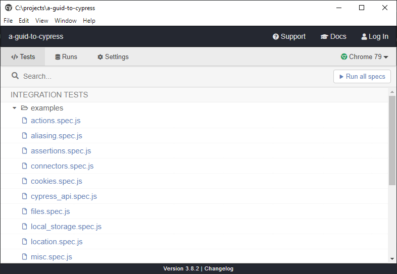
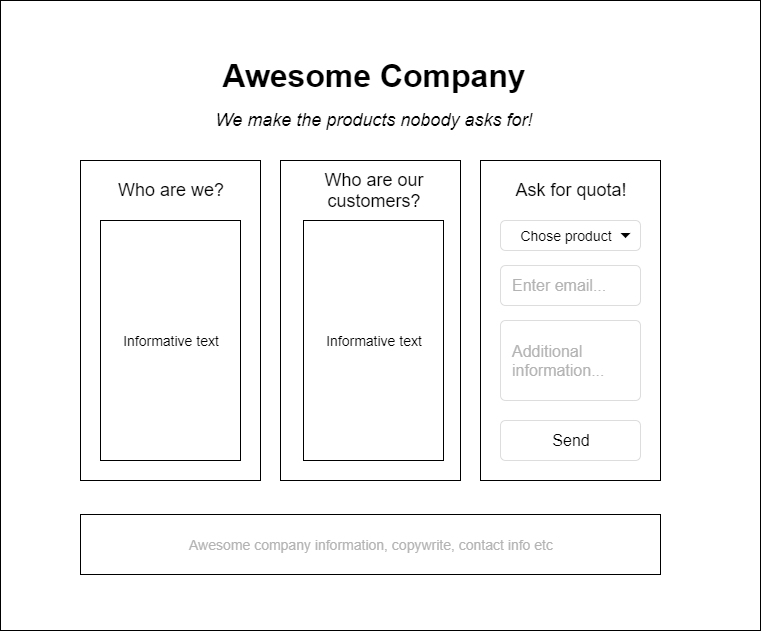
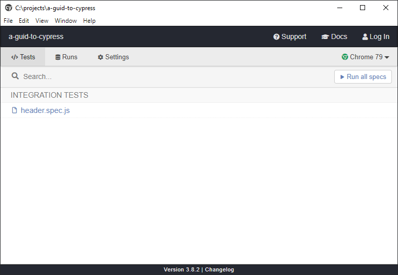
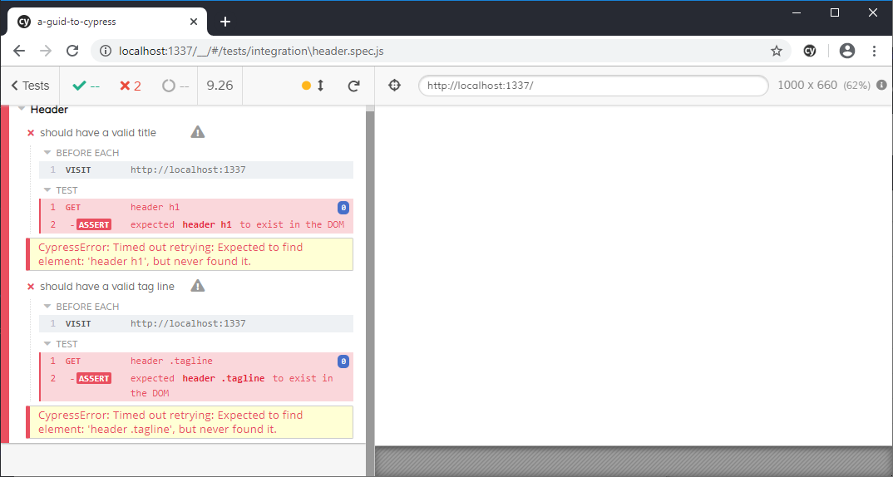
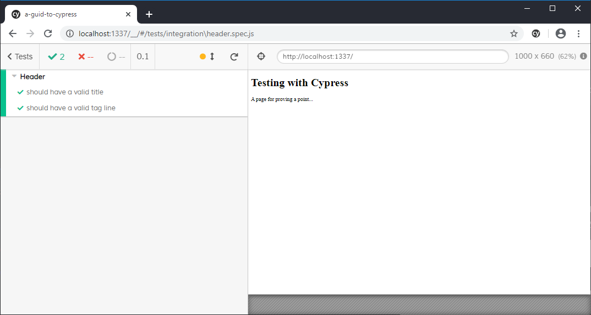
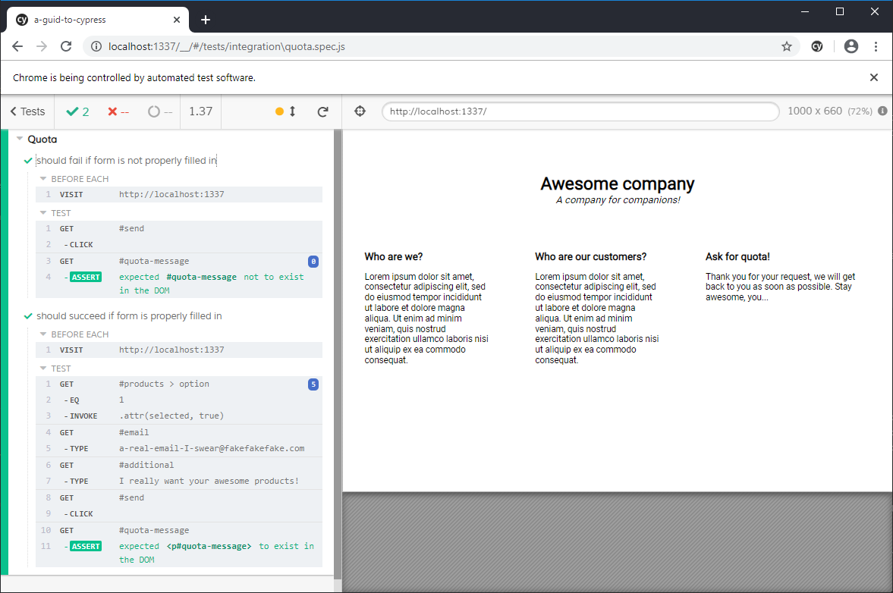

# Using Cypress for end to end testing

This is a small guide on how to use [Cypress](https://cypress.io) to test your site. It won't cover everything but will get you started with writing end to end tests for your site.

## Installation

Start by install Cypress into your project (let's also install the dev types for mocha, since that's what we'll use):

```
npm install --save-dev cypress @types/mocha
```

The start the Cypress like this:

```
./node_modules/.bin/cypress open
```

The first time you do this it will trigger a minor installation which leads to the creation of a folder in the root of your project called `cypress/`.
Afterwards it will open up the Cypress Test Runner which will look something like this after the initial install:



You can look at these examples for inspiration, but for now, let's clear the structure meaning delete everything in `cypress/fixtures/` and `cypress/integration/`. 

## Fictitious example!

In order to use this we can fake a mission: to create a company website for the most awesome company ever; Awesome Company. You've received a wireframe for their new awesome web page and it looks like this:



Their wireframe artist is the cheapest one available and even though there is more functionality on the site, the rest is sent in as a checklist:

 * When the quota is sent the form should be replaced with a little text that says "Thank you for your request, we will be in contact shortly!"
 * A product must be chosen
 * The email is required should be verified and show an error message if invalid
 * Additional information is required
 * The footer should always be up to date and contain the relevant information
 
With all these features in mind it might be a good idea to use testing as part of our development process.

***NOTE: Some of these tests could be considered slightly contrived and I'm adding them to the tutorial just to show you how they're done.***

We can start by just adding the empty site in our `src/` folder so that we have something:

```html
<!DOCTYPE html>
<html lang="en">
<head>
    <meta charset="UTF-8">
    <title></title>
</head>
<body>
</body>
</html>
```

One thing we could start by testing is that there is a header and tag line. Now, how you structure your tests is up to you and may vary from project to project. Since this is a very small project with clear, separate parts I'm going to go ahead and split the tests into the sections that I'm testing. This may mean that some test files contain very little and some very much, but that's a risk I'm willing to take.

To test our site we will have to be able to run it somewhere, so let's install `simple-server` to run the site:

```
npm install --save-dev simple-server
```

We can also add some scripts to start both Cypress and simple-server:

```
...
  "scripts": {
    "cypress:open": "cypress open",
    "start": "simple-server src/ 1337"
  },
...
```

Now if we run `npm start` the site will launch on http://localhost:1337, which is just great.

The first file I create is `cypress/integration/header.spec.js` where I will test the header part of the page. I add a first test case in a manner that will be very familiar to anyone working with Mocha tests before. There are a few differences as well:

```js
/// <reference types="Cypress" />

context("Header", () => {
    beforeEach(() => {
        // Before each test, let's make sure we're currently visiting the site
        cy.visit('http://localhost:1337');
    });
    it('should have a valid title', () => {
        cy.get('header h1').should('exist');
    });
    it('should have a valid tag line', () => {
        cy.get('header .tagline').should('exist');
    });
});
```

_The comment in the top is in order to get cypress intellisense in your editor. Some editors won't need this so feel free to remove it if you don't need it. Then we create a context for these tests and before each test is run we make sure we're visiting the site. You can do `cy.visit(...)` in every test too, but since these tests will all visit the same URL we may as well put it in a `beforeEach`._

The test is fairly simple, we want to verify that there is a h1-tag which isn't empty in the top. We also want to verify that there is a tagline just beneath it. We don't actually care what tag is used for the tagline, but it should have the class `tagline`.

If we start Cypress now (`npm run cypress:open`) we will see something like this:



If we click the `header.spec.js` link in the list the test runner will open up and execute those tests, like this:



Our test fails because our site hasn't implemented anything yet. To the right is a screenshot of the site which is depressingly blank. Let's add the header and tagline:

```html
<!DOCTYPE html>
<html lang="en">
<head>
    <meta charset="UTF-8">
    <title>Awesome Company</title>
</head>
<body>
    <header>
        <h1>Testing with Cypress</h1>
        <p class="tagline">A page for proving a point...</p>
    </header>
</body>
</html>
```

And if we run those tests again:



Now they succeed and our site is taking form in the screenshot to the right. It is a chrome browser running to the right which includes devtools and everything, so if a test fails and you want to dig into it, you can just press F12 and start debugging.

Let's write a test for our form to see what happens if you haven't filled something in and what happens if you do. Our desired behavior is that if the form is correctly filled in, the form will disappear and a message telling you that the company is working it should appear. That means that if the form doesn't post, the message shouldn't appear.

We'll create a new files next to `header.spec.js` that we call `quota.spec.js` with tests for the quota form:

```js
/// <reference types="Cypress" />

context("Quota", () => {
    beforeEach(() => {
        // Before each test, let's make sure we're currently visiting the site
        cy.visit('http://localhost:1337');
    });
    it('should fail if form is not properly filled in', () => {
        cy.get('#send').click();
        cy.get('#quota-message').should('not.exist');
    });
    it('should succeed if form is properly filled in', () => {
        cy.get('#products > option')
            .eq(1)
            .invoke('attr', 'selected', true);
        cy.get('#email').type('a-real-email-I-swear@fakefakefake.com');
        cy.get('#additional').type('I really want your awesome products!');
        cy.get('#send').click();
        cy.get('#quota-message').should('exist');
    });
});
```

The first test simply checks that if we click send we don't get the message. The seconds one sets the form in such a way that it can be considered valid and then expects an element with the ID `quota-message` to be shown.

We can make a horrible implementation like this:

```html
...
            <form id="quota" action="#" method="post">
                <p>
                    <select id="products" required>
                        <option value="">Chose product</option>
                        <option value="any">Any product</option>
                        <option value="product1">Product 1</option>
                        <option value="product2">Product 2</option>
                        <option value="product3">Product 3</option>
                    </select>
                </p>
                <p>
                    <input type="email" id="email" placeholder="Enter email..." required/>
                </p>
                <p>
                    <textarea id="additional" placeholder="Additional information..." required></textarea>
                </p>
                <p>
                    <button id="send" type="submit">Send</button>
                </p>
            </form>
...
<script>
    document.getElementById('quota').addEventListener('submit', (e) => {
        e.preventDefault();
        console.log(this);
        document.getElementById('quota').innerHTML = '<p id="quota-message">Thank you for your request, we will get back to you as soon as possible. Stay awesome, you...</p>';
    })
</script>
```

This may not be production-ready code, but it serves its purpose. If the form isn't correctly filled in the native HTML validation will kick in and prevent form submission. If it succeeds our javascript will "handle" it from there and replace the form with the desired text. The test works:



## Stubbing and fixtures

Now, these were quite simple tests that essentially tested basic functionality. But what if things get a bit more complex. What if Awesome Company has links to their support team in the footer and the support team changes depending on who's working. This is of course a terrible solution for any company, but not for Awesome Company.

This means that the e-mails to the current support team is fetched via some kind of API and then looped out in the footer together with the rest of the information. Something like:

_Awesome Company ©2020, to get in contact with support, please contact: Adrian, Jenny or Trent!_

So, two things to test here; is the copyright correct and are the support emails being rendered correctly. Let's create a `footer.spec.js` and add some tests:

```js
/// <reference types="Cypress" />

context("Footer", () => {
    beforeEach(() => {
        // Before each test, let's make sure we're currently visiting the site
        cy.visit('http://localhost:1337');
    });
    it('should have the correct copyright year', () => {
        cy.get('#company-copyright-year').contains(new Date().getFullYear());
    });
    it('should render the support emails correctly', () => {
        // How the **** do we test this?
    });
});
```

The year isn't exactly hard to test given what we've learned so far. But the emails? Well, they are requested from an API and we happen to know which returns data something similar to this:

```json
[
  {
    "name": "Adrian",
    "mail": "Adrian@support.org"
  },
  {
    "name": "Jenny",
    "mail": "Jenny@support.org"
  },
  {
    "name": "Trent",
    "mail": "Trent@support.org"
  }
]
```

Given that data, they will output three links which uses this data. Now, if we want to do proper end to end testing and we have somewhat full control of the backend then this is all good. But if we don't trust the backend or for some other reason want to mock this data, Cypress provides means for this as well.
Having that said, there are still some issues with the `fetch` command that has become very popular. The Cypress team is [working](https://github.com/cypress-io/cypress/issues/95) on it, but in the mean time you can only mock `xhr` requests, not `fetch` requests. Now, if you're using fetch anyway there [are ways](https://dev.to/matsilva/fetch-api-gotcha-in-cypress-io-and-how-to-fix-it-7ah) to mock it, they just include a couple of extra steps.

If we are using standard `xhr` requests (or are mocking our fetches as in the link above) and want to mock our network responses we can create a fixture in the `cypress/fixtures` folder with data that you can copy from a real request and edit as you may want, this is my `cypress/fixtures/support.json` mock:

```json
[
  {
    "name": "Test 1",
    "mail": "test1@support.org"
  },
  {
    "name": "Test 2",
    "mail": "test2@support.org"
  },
  {
    "name": "Test 3",
    "mail": "test3@support.org"
  }
]
```

To use this mock, set your test up like this:

```js
/// <reference types="Cypress" />

context("Footer", () => {
    it('should have the correct copyright year', () => {
        cy.get('#company-copyright-year').contains(new Date().getFullYear());
    });
    it('should have three correct support links', () => {
        cy.server(); // Enable response stubbing
        cy.route('GET', '**/api/support.json', 'fixture:support.json');
        cy.visit('http://localhost:1337');
        cy.get('#support-team a').should('have.length', 3);
        cy.get('#support-team a').eq(0).contains('Test 1');
        cy.get('#support-team a').eq(0).invoke('attr', 'href', 'test1@support.org');
    });
});
```

In order to control and route responses we need to start a server, which is done with the `cy.server` command. Once launched, we can use the `cy.route` command to intercept a call to a certain URL and return a response of our own. As you can see in the example above, we're intercepting `**/api/support.json` and returning our fixture instead. Then we test that the data resulted in three links and that at least one of them used the data correctly.

I'm not saying you should mock all your responses, if you want true end to end testing it should probably be a full setup meaning you contact your real end. But sometimes your setup relies on third party providers that cannot be trusted to run at all time or you're running your tests on a machine without access to your API. In these cases these methods may be of use.

## Useful links:

**Documentation for commands and assertions:**

https://docs.cypress.io/api/api/

**Examples:**

https://docs.cypress.io/examples/examples/recipes.html

**A one day Cypress workshop:**

https://github.com/cypress-io/testing-workshop-cypress